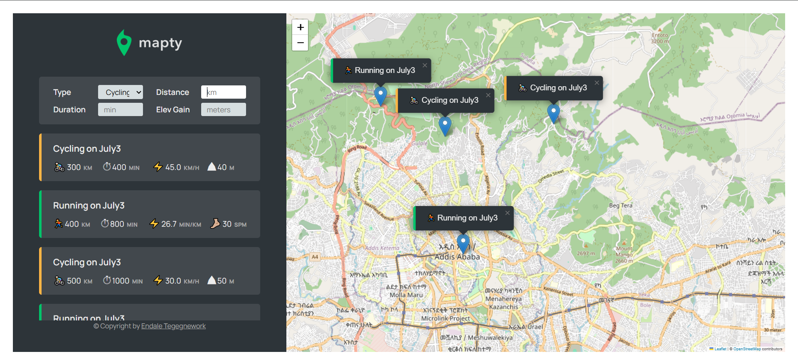

# Mapty

Mapty is a web application that allows users to log their running and cycling workouts on an interactive map. The app uses geolocation to determine your position, lets you add workouts by clicking on the map, and stores your data in the browser's local storage for persistence.

## Features

- 📍 **Geolocation**: Automatically detects your current location and centers the map.
- 🗺️ **Interactive Map**: Powered by [Leaflet](https://leafletjs.com/), click anywhere on the map to log a workout.
- 🏃‍♂️ **Running & Cycling Workouts**: Log distance, duration, cadence (for running), and elevation gain (for cycling).
- 📝 **Workout List**: View all your workouts in a list below the map.
- 📌 **Map Markers**: Each workout is marked on the map with a popup showing details.
- 💾 **Local Storage**: All workouts are saved in your browser, so your data persists across sessions.
- 🔄 **Jump to Workout**: Click a workout in the list to pan/zoom the map to its location.

## Demo



## Getting Started

### Prerequisites
- A modern web browser (Chrome, Firefox, Edge, Safari)
- Internet connection (for map tiles)

### Installation
1. **Clone the repository:**
   ```bash
   git clone https://github.com/yourusername/mapty.git
   cd mapty
   ```
2. **Open `index.html` in your browser:**
   - You can simply double-click `index.html` or use a local server for best results.

### Usage
1. Allow the browser to access your location when prompted.
2. Click anywhere on the map to add a new workout.
3. Fill in the workout details and submit the form.
4. Your workout will appear both on the map and in the list below.
5. Click a workout in the list to move the map to its marker.
6. Your data is saved automatically in local storage.

### Resetting Data
To clear all workouts and start fresh, open the browser console and run:
```js
app.reset();
```

## Technologies Used
- [JavaScript (ES6+)](https://developer.mozilla.org/en-US/docs/Web/JavaScript)
- [Leaflet.js](https://leafletjs.com/) for interactive maps
- [HTML5 & CSS3](https://developer.mozilla.org/en-US/docs/Web)

## Project Structure
```
Locator/
  ├── index.html
  ├── script.js
  ├── style.css
  ├── icon.png
  ├── logo.png
  └── README.md
```

## Credits
- Map tiles by [OpenStreetMap](https://www.openstreetmap.org/)
- Map rendering by [Leaflet](https://leafletjs.com/)
- Inspired by Jonas Schmedtmann's Mapty project

## License
This project is for educational purposes. Feel free to use and modify it for your own learning!
